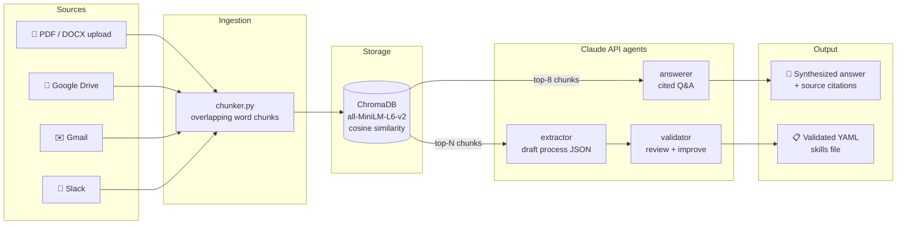
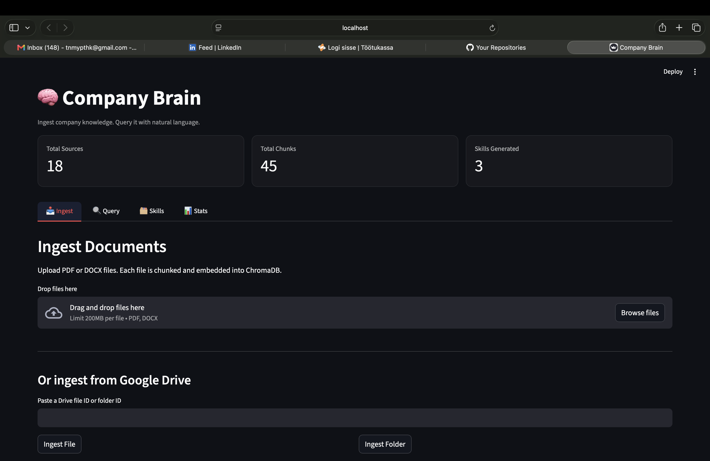
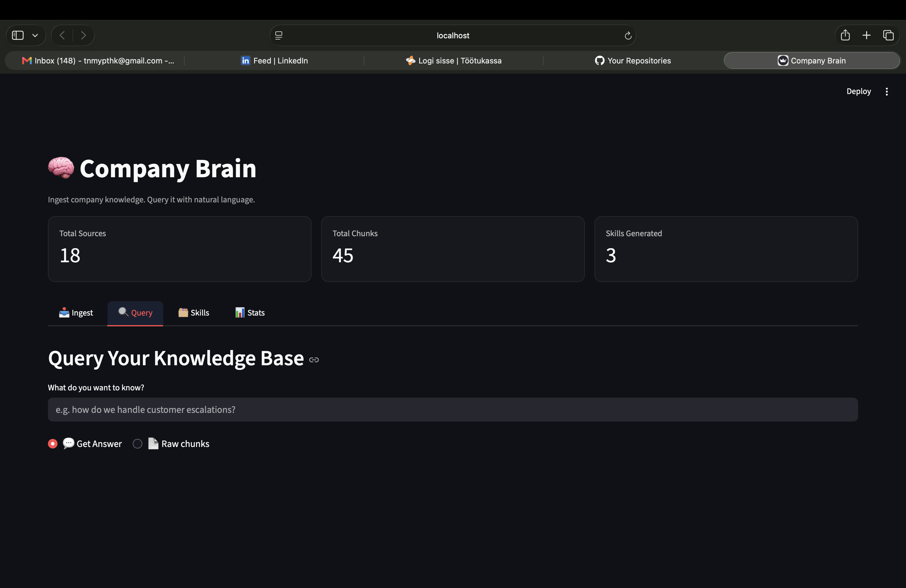
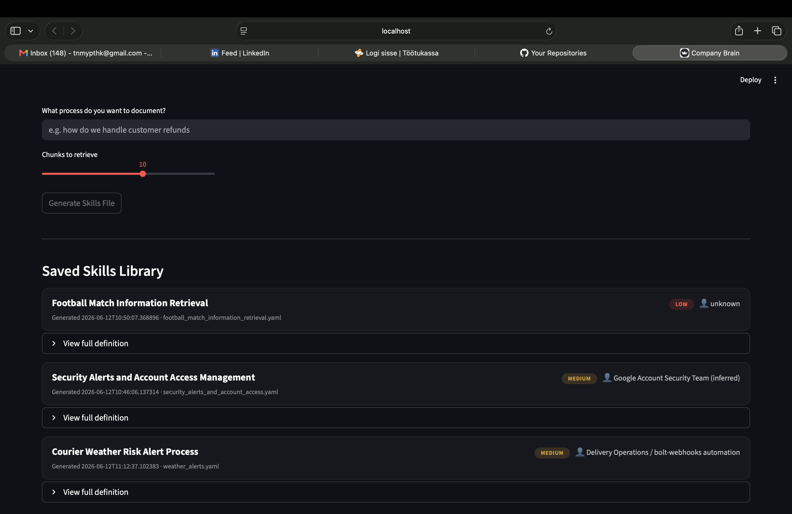
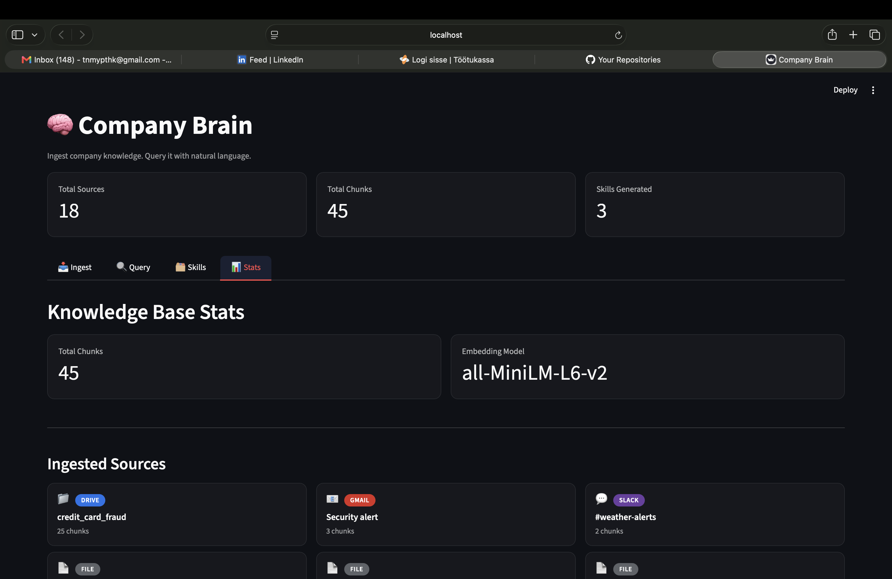

# 🧠 Company Brain

**Ingest your company's scattered knowledge. Query it in plain English. Turn tribal knowledge into documented, validated processes.**

Company Brain is a self-hosted RAG (Retrieval-Augmented Generation) system inspired by Y Combinator's [Request for Startups](https://www.ycombinator.com/rfs) theme of internal agents that actually know how your company works. Every company's operational knowledge — how refunds get approved, what to do when an alert fires, who owns which process — lives fragmented across Slack threads, email chains, Drive docs, and people's heads. Company Brain pulls all of it into one local vector database, answers questions against it with citations, and goes a step further than search: a two-agent Claude pipeline extracts *structured, validated process documentation* (YAML "skills files") from the raw knowledge, turning "ask Dave, he knows" into a reviewable artifact.

## Architecture



Everything runs locally: documents, embeddings, and the vector DB never leave your machine. Only retrieved chunk text is sent to the Claude API at query time.

## Running locally

```bash
# 1. Clone and create a virtualenv (Python 3.9+)
git clone <repo-url> && cd company-brain
python -m venv cb-env
source cb-env/bin/activate
pip install -r requirements.txt

# 2. Configure secrets
cp .env.example .env   # or create .env with:
#   ANTHROPIC_API_KEY=sk-ant-...        (required — console.anthropic.com)
#   SLACK_BOT_TOKEN=xoxb-...            (optional — Slack ingestion)
# For Google Drive/Gmail: place OAuth credentials.json in the project root
# (Google Cloud Console → Drive API + Gmail API → OAuth Desktop credentials)

# 3. Launch the dashboard
./run_dashboard.sh
# or: PYTHONPATH=. streamlit run dashboard/app.py
```

There's also a CLI for headless use: `python ingest.py file doc.pdf`, `python ingest.py gmail 30`, `python ingest.py query "how do we handle escalations"` — see `ingest.py --help`.

| Env var / file | Required | Purpose |
|---|---|---|
| `ANTHROPIC_API_KEY` | ✅ | Claude API for answers, extraction, validation |
| `SLACK_BOT_TOKEN` | optional | Slack channel ingestion (`channels:read`, `channels:history`, `users:read`) |
| `credentials.json` | optional | Google OAuth for Drive + Gmail ingestion |

## Screenshots

| Ingest | Query | Skills | Stats |
|---|---|---|---|
|  |  |  |  |

## Tech stack

| Layer | Choice | Why |
|---|---|---|
| LLM | Claude API (Sonnet 4.6 + Opus 4.8) | Structured outputs for guaranteed-valid JSON; cheap generator + strong critic split across the 2-agent pipeline |
| Vector DB | ChromaDB (persistent, local) | Zero-infrastructure, in-process; swappable behind `storage/chroma.py` |
| Embeddings | sentence-transformers `all-MiniLM-L6-v2` | Local + free; no API calls for ingestion or search |
| UI | Streamlit | Whole dashboard is one Python file; ideal for fast iteration |
| Ingestion | PyPDF2, python-docx, Google API client, slack_sdk | One module per source, all funneling into a shared chunker |
| Config | python-dotenv | Secrets stay in `.env`, out of git |

## How the 2-agent pipeline works

The Skills tab doesn't just generate documentation — it reviews it. An **extractor** agent (Sonnet) retrieves relevant chunks and drafts a structured process definition; a **validator** agent (Opus) then critiques the draft with a fresh context: are the steps actually executable? Are the edge cases real or speculative? Is the confidence honest? The validator returns an improved version plus `validation_notes` — a human-readable audit trail of what it checked and changed. Generation and critique are separated because a model reviewing its own output in the same context tends to defend its mistakes; a fresh-context critic reads the draft the way a new employee would.

## Roadmap

- [x] **Week 1** — ingestion pipeline (files, Drive, Gmail, Slack), ChromaDB storage, chunking, CLI
- [x] **Week 1** — Streamlit dashboard: ingest, query, stats
- [x] **Week 1** — 2-agent skills pipeline (extractor → validator) with structured outputs
- [x] **Week 1** — synthesized Q&A with source citations
- [ ] Thread-aware Slack ingestion (`conversations_replies`)
- [ ] DOCX table extraction (currently body paragraphs only)
- [ ] Re-ranking retrieved chunks before synthesis (cross-encoder or LLM re-rank)
- [ ] Scheduled re-ingestion so the brain stays current
- [ ] Skills file → executable automation (the YAML is structured for a reason)
- [ ] Multi-user deployment with per-source access control
